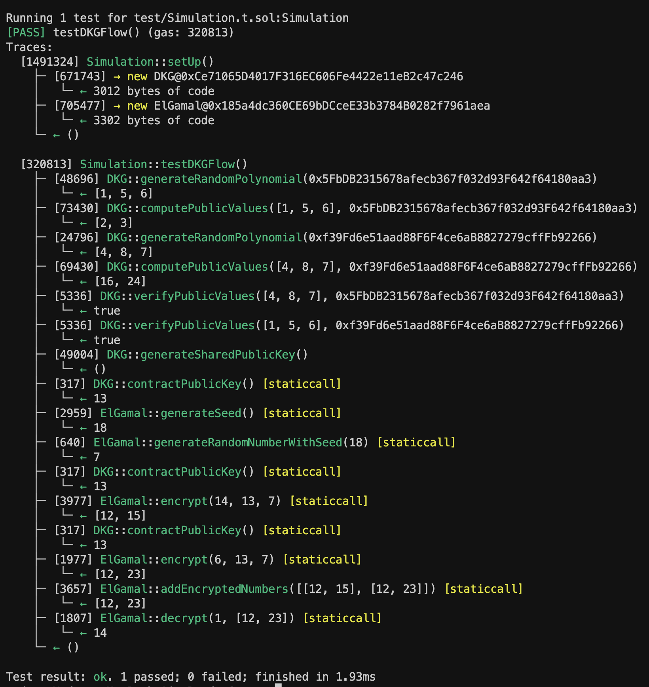

## Trustless Random Number Generation

This repository contains the Solidity contracts for a decentralized protocol for generating verifiably random numbers. The protocol is based on the research paper [Dynamic User Entropy](https://www.ontropy.io/Math_Whitepaper.pdf) and is intended for use in multiplayer games that require a fair and secure method of generating random numbers.

### Contracts

- DKG.sol: Contains the contract for the Distributed Key Generation (DKG) process

- ElGamal.sol: Contains the contract for the ElGamal encryption process

### Run Test Simulation

```shell
forge install
forge test -vvvvv
```

### Deploy your own set of contracts

```shell
npx thirdweb
npx thirdweb build
npx thirdweb deploy
```

### Deployed contracts on Polygon Testnet (Mumbai)

- [DKG.sol](https://thirdweb.com/mumbai/0xd318d9F46e074C4F13888D8009Da91756bb07990/)
- [ElGamal.sol](https://thirdweb.com/mumbai/0x717f7DcAd978d873B386933DcCf8cd4F6fCbBE57/)

### Simulation Results


